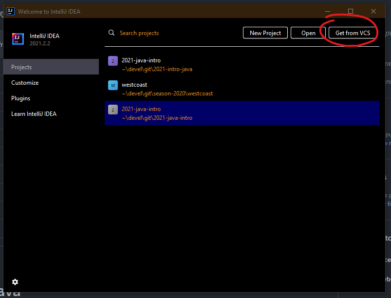
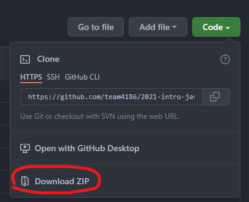
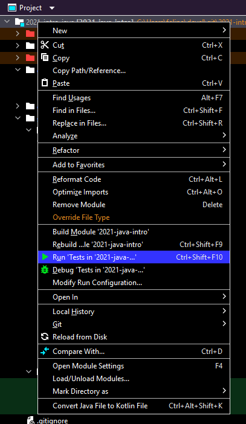
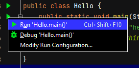
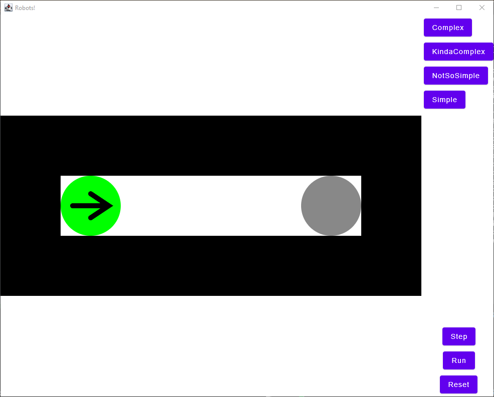

# 2021-intro-java

This project contains simple exercises trying to train the student in the ways of programming.

It is build using the [Gradle](https://gradle.org/) build system because this is how we build our software for the robot,
so you need to build some familiarity with it.

## Setup

(optional) Go ahead and create a new Github account, ask to join the team's programming group.

Use of IntelliJ is recommended, but this project should work on Visual Studio Code.
And as a gradle project should work and depends only on JDK.

IntelliJ should give hints on what is missing and suggest actions so you can compile the project. 

We are using features of Java 15 so if you are not using IntelliJ download a JDK >= 15.

Git can be used to download the project and keep receiving updates.

Mac, Windows, and Linux have package management systems which can make the setup easier.

### Checks
If you are going the hard way:
* check JDK: type `javac -version` on a terminal and see if it prints the version, also check the version
* check Git: type `git --version` on a terminal and see if it prints the version and not an OS error

### Links
* [IntelliJ](https://www.jetbrains.com/idea/download)
* [Open Jdk](https://openjdk.java.net/projects/jdk/)
* [Oracle Jdk](https://www.oracle.com/java/technologies/downloads/)
* [Git](https://git-scm.com/)

## Getting the project
### Using Git (preferred)


Select Git on the next screen and paste `https://github.com/team4186/2021-intro-java.git` in the `URL` field.
Also set `Directory` to your work folder (can be your desktop).

Or on a terminal go to your work folder (can be your desktop) and type `git clone https://github.com/team4186/2021-intro-java.git`

### Zip File 


or click [here](https://github.com/team4186/2021-intro-java/archive/refs/heads/main.zip)

After the download just unzip on your work folder (can be your desktop)

## Instructions
Exercises are located under `src/main/java`, recommended order is (heads up IntelliJ hides the file extension):
1. `Types.java`
2. `Variables.java` 
3. `Expressions.java`
4. `ControlFlow.java`
5. `oldschool/*`
6. `maze/Maze.java`
7. `apps.*`

### Test based
`Types`, `Variables`, `Expressions`, `ControlFlow`, and `Maze` all have tests to evaluate your answers. They are not super smart tests and you can cheat your way around then. Recommended direction is to experiment and try to solve each exercise in different ways (maybe find some cases where the tests fail).

The `Maze` are more advanced and we will come back to them bellow.

To run the tests right click (context menu) over the project line in the `project` tab and then click in `run tests...`.

this will run the tests to check if your answers for each exercise are producing some valid results.

### Free from
In the `oldschool` folder you will find a few exercises where you can build some simple terminal programs. Suggestions of what todo is documented inside each of the java files.

To run them on IntelliJ you can:
* run from the context menu on each file (`Run <something>.main()`)
* run from the gutter icon:
  * 
  
And there are a few other ways you can find out.

On the terminal you have to build the project and run the specific class:
```
$ gradlew jar
wait the build
$ java -cp build\libs\2021-java-intro-1.0-SNAPSHOT.jar oldschool.Hello
```
replace `oldschool.Hello` by the program you want to run (program is any class with a `main` function in it)

### Mazes

Besides being a testable exercise, the Mazes can be run in a terminal window or in a GUI application.
You can run `MazeApp` or the `MazeCLI` using the context menu, gutter icon, or terminal.
You can play with the code and add new Mazes (follow the other mazes template) and the apps will recognize them.

For the GUI version:
```
$ gradlew jar
wait the build
$ java -cp build\libs\2021-java-intro-1.0-SNAPSHOT.jar apps.MazeApp
```

For the CLI version:
```
$ gradlew jar
wait the build
$ java -cp build\libs\2021-java-intro-1.0-SNAPSHOT.jar apps.MazeCLI
```
